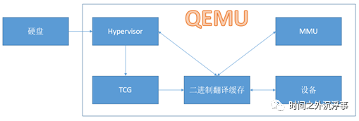
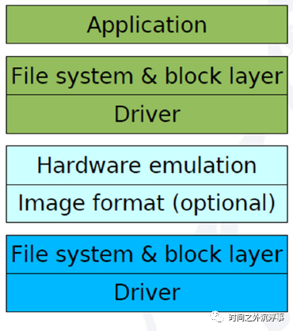
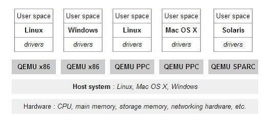
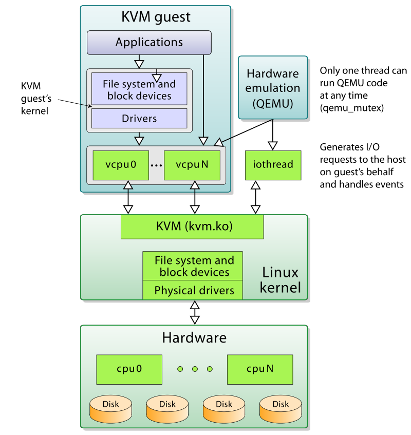
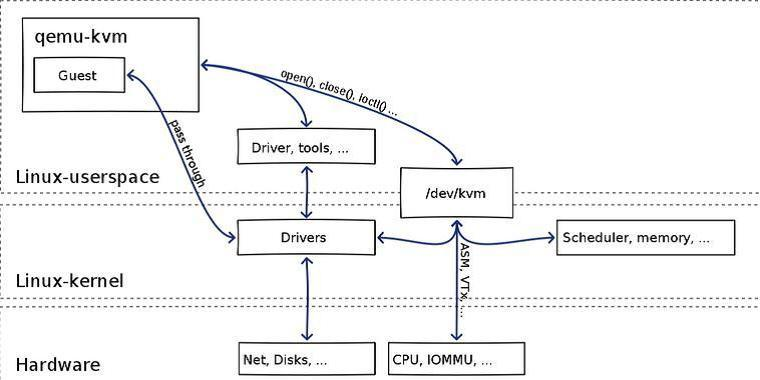

qemu-demo
=============

QEMU是“Quick Emulator”的缩写，是一个用C语言编写的开源虚拟化软件。本文的目的是描述本人所理解的QEMU技术架构的见解，并以此抛砖引玉。众所周知，QEMU的源代码开发文档非常稀少，描述内部结构和工作机理的文档更是凤毛麟角，一般的开发人员想要从事QEMU的开发工作，通常只能从源代码入手。因此，对于技术人员来说，了解QEMU是一项艰巨的任务。

QEMU有几种虚拟化模式。首先，它可以使用基于内核的虚拟机（KVM）执行x86处理器硬件虚拟化，以几乎比拟硬件本机的速度执行运算任务。其次，它可以通过机器代码的实时转换来模拟其他处理器以用于虚拟机运行不同平台的操作系统。最后，它可以使用实时转换为其他架构运行简单的程序，类似于Linux中的Wine。因为QEMU没有图形用户界面（GUI），而其提供的核心能力又是关键而重要的，因此通常用作更复杂的虚拟化管理器的一部分。比如，我们经常使用的开源VirtualBox、Xen虚拟化产品，其核心底层的虚拟化部分就有集成和使用QEMU，此外，主流的KVM虚拟化也是集成和使用QEMU的主力虚拟化管理器系统。

从KVM的角度来说，KVM（Kernel Virtual Machine）是Linux的一个内核驱动模块，它能够让Linux主机成为一个Hypervisor（虚拟机监控器）。在支持VMX（Virtual Machine Extension）功能的x86处理器中，Linux在原有的用户模式和内核模式中新增加了客户模式，并且客户模式也拥有自己的内核模式和用户模式，虚拟机就是运行在客户模式中。KVM模块的职责就是打开并初始化VMX功能，提供相应的接口以支持虚拟机的运行。KVM通过调用Linux本身内核功能，实现对CPU的底层虚拟化和内存的虚拟化，使Linux内核成为虚拟化层。KVM在2007年2月被导入Linux 2.6.20内核中。从存在形式来看，它包括两个内核模块：kvm.ko和kvm_intel.ko（或kvm_amd.ko），本质上，KVM是管理虚拟硬件设备的驱动，该驱动使用字符设备/dev/kvm（由KVM本身创建）作为管理接口，主要负责vCPU的创建、虚拟内存的分配、vCPU寄存器的读写以及vCPU的运行。

从QEMU的角度来说，QEMU（Quick Emulator)本身并不包含或依赖KVM模块，而是一套由Fabrice Bellard编写的模拟计算机的自由软件。QEMU虚拟机是一个纯软件的实现，可以在没有KVM模块的情况下独立运行，但是性能比较低。QEMU有整套的虚拟机实现，包括处理器虚拟化、内存虚拟化以及I/O设备的虚拟化。在不需要KVM加速的情况下，QEMU通过一个特殊的“重编译器”对特定的处理器的二进制代码进行翻译，从而具有了跨平台的通用性。QEMU有两种工作模式：系统模式，可以模拟出整个电脑系统，另一种是用户模式，可以运行不同与当前硬件平台的其他平台上的程序（比如在x86平台上运行跑在ARM平台上的程序）。目前最新版本是4.x。从QEMU角度来看，虚拟机运行期间，QEMU通过KVM模块提供的系统调用接口进行内核设置，由KVM模块负责将虚拟机置于处理器的VMX模式运行。QEMU使用了KVM模块的虚拟化功能，为自己的虚拟机提供硬件虚拟化加速以提高虚拟机的性能。

而现在流行的KVM虚拟化平台，就是在修改了QEMU代码，把他模拟CPU、内存的代码换成KVM，而网卡、显示器等留着，因此QEMU+KVM就成了一个完整的虚拟化平台。由于KVM运行在内核空间，只是内核模块，QEMU运行在用户空间，实际模拟创建，管理各种虚拟硬件（磁盘，网卡，显卡等）。从KVM的角度来说，用户没法直接跟内核模块交互，需要借助用户空间的管理工具，因此需要借助QEMU这个运行在用户空间的工具。KVM和QEMU相辅相成，QEMU通过KVM达到了硬件虚拟化的速度，而KVM则通过QEMU来模拟设备并实现和内核空间的KVM的交互，虽然这个交互并不仅仅只有QEMU能够办到。此外，由于QEMU模拟IO设备效率不高的原因，现在常常采用半虚拟化的virtio方式来虚拟IO设备。

综上，理解了QEMU和KVM的关系，也就理解了VirtualBox、Xen等虚拟化产品集成和使用QEMU的关系。

Hypervisor控制仿真
Tiny Code Generator（TCG）在虚拟机器代码和宿主机代码之间进行转换。
软件内存管理单元（MMU）处理内存访问。
磁盘子系统处理不同的磁盘映像格式
设备子系统处理网卡和其他硬件设备

2.3 硬件设备
虚拟机的硬件设备要求可以通过直接连接主机中的实际物理设备或通过QEMU中的硬件设备仿真来实现。与硬件相关的大多数QEMU代码位于目录“hw”中。

在QEMU中，存在两种使用硬件设备的方式：直通模式使用主机实际物理设备和QEMU的设备驱动仿真实现的模拟虚拟设备。如果采用直通方式使用实际的物理设备，那么就会抢占主机的设备使用权，并且其他虚拟机也将无法使用该物理设备。在直通模式中，虚拟机可以直接访问USB总线或PCI总线，并可以直接与设备通信。一般情况下，采用直通模式的物理设备都是很难进行QEMU仿真的设备，比如网络摄像头、串行和并行端口等。其他设备因为大部分虚拟机都会使用，而且很难与主机共享，例如网络设备，因此大都会使用QEMU模拟仿真的虚拟设备。比如在虚拟机的网络设备中，可通过模拟网卡来解决，从而在网络堆栈上添加额外的层。此外，QEMU可以选择连接到Linux内核中的“virtio”半虚拟化驱动程序，这意味着Linux内核处理虚拟机和硬件设备之间的输入/输出，而不采用QEMU的模拟设备进行中转和传输（仅用作中介）。

2.4 磁盘映像
QEMU可以处理几种不同的磁盘映像格式。首选格式为raw或qcow2。Raw是一种非常简单的格式，它将文件系统中的字节逐字节存储在文件中。大多数其他仿真器都支持此格式。Qcow2是QEMU自己的图像格式，对小图像很有用，并且支持磁盘映像压缩以及捕获磁盘映像状态的快照。还支持另外两种格式：在VirtualBox中使用的vdi和在VMWare中使用的vmdk。

QEMU的磁盘映像通过其存储IO协议栈来进行支持，其存储协议栈如下图所示：

从QEMU的存储协议栈来说，应用程序和虚拟机内核的工作类似于裸机。虚拟机通过仿真硬件与QEMU交互，并将IO执行情况的控制流和数据流交互给QEMU，QEMU代表虚拟机对磁盘镜像文件执行I / O操作。而从主机内核层面上，主机内核会将虚拟机I / O视为一种用户空间的应用程序IO请求进行正常的执行处理。整个QEMU的存储协议栈相比较Linux的存储协议栈而言，中间会加一层中间层以做虚拟化处理。本文将不展开对QEMU的存储协议栈进行细述。

2.5 软件MMU
传统处理器中的内存管理单元（MMU）处理对计算机内存位置的访问。当处理器想要访问某个存储器地址时，MMU获取该地址的内容。此内容可以来自处理器芯片上的本地快速缓存，来自随机存取存储器（RAM）或来自光盘。它甚至可以做出一些关于缓存某些内存位置的控制决定。

QEMU有一个基于软件的MMU，其工作方式与硬件MMU类似。它使用地址转换缓存，其中包含访客地址、主机地址和偏移值，以提高转换速度。它还允许智能链接代码块，以便在没有内存故障的情况下实现更快的执行，其中必须重新加载和重新转换内存块。

在寻找在QEMU中运行的虚拟机的漏洞时，软件MMU是否正在进行翻译和正确放置块会是其测试和Fuzz的重点。

QEMU,KVM及QEMU-KVM介绍
========

What's QEMU
QEMU是一个主机上的VMM（virtual machine monitor）,通过动态二进制转换来模拟CPU，并提供一系列的硬件模型，使guest os认为自己和硬件直接打交道，其实是同QEMU模拟出来的硬件打交道，QEMU再将这些指令翻译给真正硬件进行操作。通过这种模式，guest os可以和主机上的硬盘，网卡，CPU，CD-ROM，音频设备和USB设备进行交互。但由于所有指令都需要经过QEMU来翻译，因而性能会比较差：

What's KVM?
KVM实际是linux内核提供的虚拟化架构，可将内核直接充当hypervisor来使用。KVM需要处理器硬件本身支持虚拟化扩展，如intel VT 和AMD AMD-V技术。KVM自2.6.20版本后已合入主干并发行，除此之外，还以模块形式被移植到FreeBSD和illumos中。除了支持x86的处理器，同时也支持S/390,PowerPC,IA-61以及ARM等平台。

工作原理
KVM包含一个内核模块kvm.ko用来实现核心虚拟化功能，以及一个和处理器强相关的模块如kvm-intel.ko或kvm-amd.ko。KVM本身不实现任何模拟，仅仅是暴露了一个/dev/kvm接口，这个接口可被宿主机用来主要负责vCPU的创建，虚拟内存的地址空间分配，vCPU寄存器的读写以及vCPU的运行。有了KVM以后，guest os的CPU指令不用再经过QEMU来转译便可直接运行，大大提高了运行速度。但KVM的kvm.ko本身只提供了CPU和内存的虚拟化，所以它必须结合QEMU才能构成一个完整的虚拟化技术，也就是下面要介绍的技术。

What's QEMU-KVM
从前面的介绍可知，KVM负责cpu虚拟化+内存虚拟化，实现了cpu和内存的虚拟化，但kvm并不能模拟其他设备，还必须有个运行在用户空间的工具才行。KVM的开发者选择了比较成熟的开源虚拟化软件QEMU来作为这个工具，QEMU模拟IO设备（网卡，磁盘等），对其进行了修改，最后形成了QEMU-KVM。

在QEMU-KVM中，KVM运行在内核空间，QEMU运行在用户空间，实际模拟创建、管理各种虚拟硬件，QEMU将KVM整合了进来，通过/ioctl 调用 /dev/kvm，从而将CPU指令的部分交给内核模块来做，KVM实现了CPU和内存的虚拟化，但KVM不能虚拟其他硬件设备，因此qemu还有模拟IO设备（磁盘，网卡，显卡等）的作用，KVM加上QEMU后就是完整意义上的服务器虚拟化。
综上所述，QEMU-KVM具有两大作用：

提供对cpu，内存（KVM负责），IO设备（QEMU负责）的虚拟
对各种虚拟设备的创建，调用进行管理（QEMU负责）
这个方案中，QEMU模拟其他的硬件，如Network, Disk，同样会影响这些设备的性能。于是又产生了pass through半虚拟化设备virtio_blk, virtio_net，提高设备性能。

QEMU-KVM，是QEMU的一个特定于KVM加速模块的分支，里面包含了很多关于KVM的特定代码，与KVM模块一起配合使用。
目前QEMU-KVM已经与QEMU合二为一，所有特定于KVM的代码也都合入了QEMU，当需要与KVM模块配合使用的时候，只需要在QEMU命令行加上 --enable-kvm就可以。

